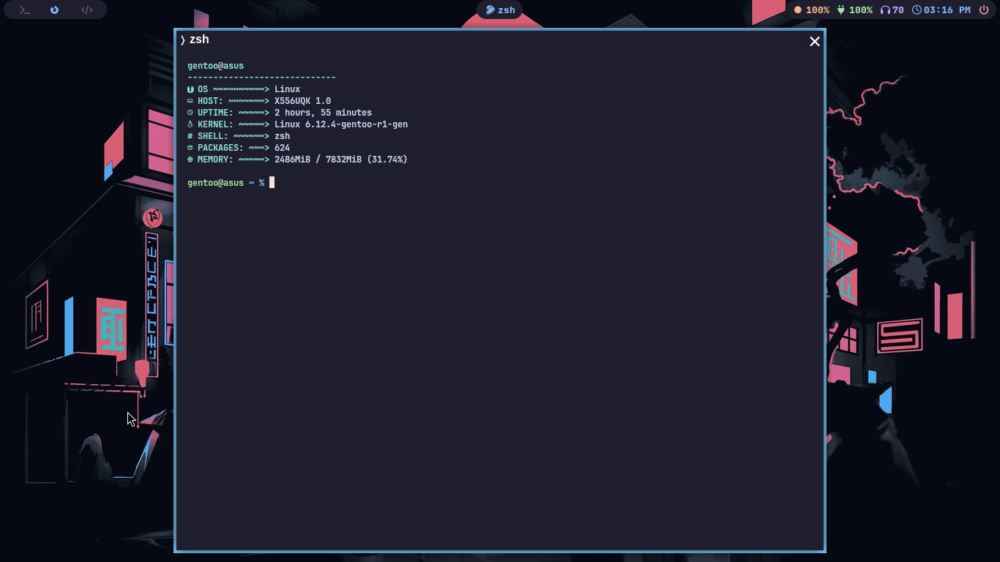

<h1 align="center">My Dotfiles</h1>

This is where I keep all of my dotfiles and scripts for my rice.

Feel free to copy any of the dotfiles or scripts you find here, as much of it is just copied from others' dotfiles. I wouldn't recommend cloning my entire setup, but instead to try copying bits and pieces as you put together your own dotfiles unique to you. As what I did to my own dotfiles. I started to learn how to do stuff in ricing!

For other projects made by me, go to my [Page](https://github.com/arch-based/). There, you'll see my projects that I am working on, such as my dotfiles, and different types of reimplementation of fetcher. Sadly fetcher-based was replaced with Rust because of the security vulnerablities on C++.
## Software I Use

- Operating System btw: [Arch Linux](https://archlinux.org/)
- Window Manager: [Hyprland](https://github.com/hyprwm/Hyprland)
- Status Bar: [Waybar](https://github.com/Alexays/Waybar)
- Terminal: [kitty](https://github.com/kovidgoyal/kitty)
- Shell: [zsh](https://www.zsh.org/)
- Launcher: [wofi](https://man.archlinux.org/man/wofi.1.en)
- File Manager: [lf](https://github.com/gokcehan/lf) for TUI or [Thunar](https://docs.xfce.org/xfce/thunar/start) for GUI
- Notifications: [dunst](https://github.com/dunst-project/dunst)
- Image Viewer: [imv](https://sr.ht/~exec64/imv/)
- Video Player: [mpv](https://github.com/mpv-player/mpv)
- Lockscreen: [hyprlock](https://github.com/hyprwm/hyprlock/)
- Idle Daemon: [hypridle](https://github.com/hyprwm/hypridle)
- Fonts: [Cantarell](https://gitlab.gnome.org/GNOME/cantarell-fonts) and [Maple Mono](https://github.com/subframe7536/maple-font)
